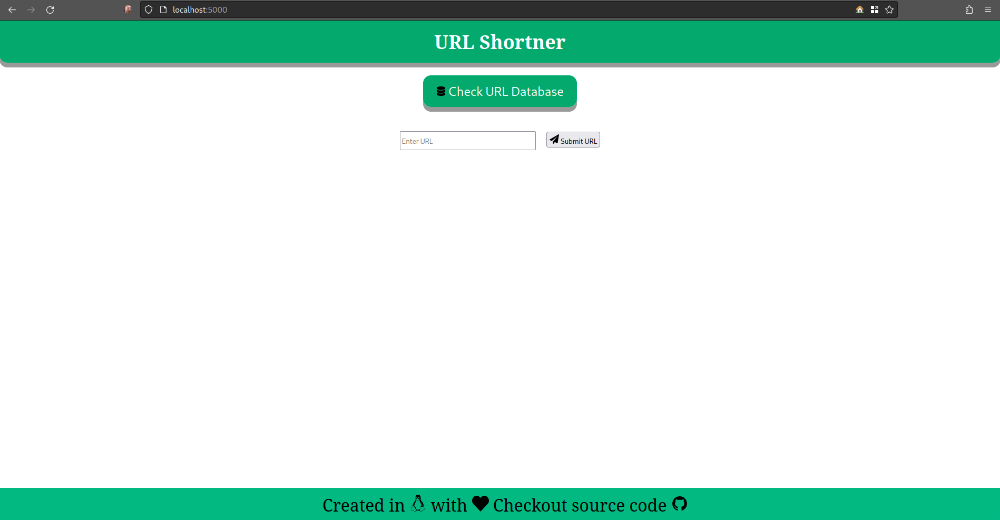
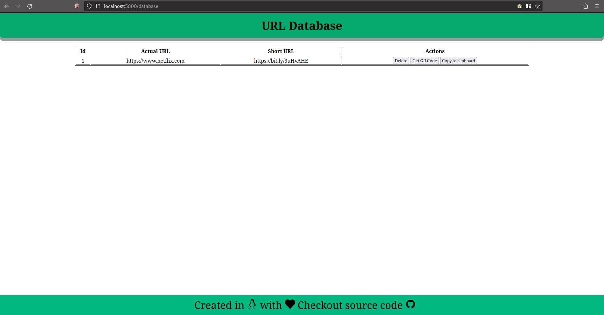
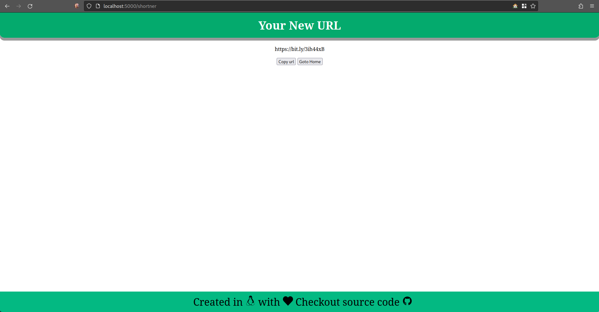
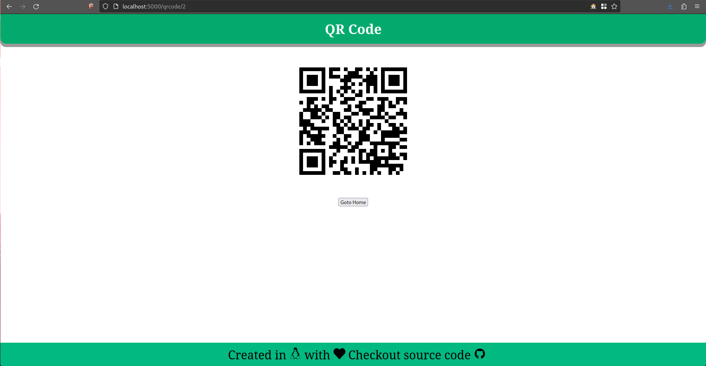

# URL Shortener App

A url-shortner built using flask and Bitly api. It has following dependencies:

* Flask - Core dependency
* SQLAlchemy - For working with database
* requests - For sending GET and POST request
* pyperclip - For copy to clipboard functionality
* PyQRCode - For generating QR code of URL

For using bitly api go to [Bitly](https://bitly.com/) 
website and get a free account to get authentication key and group id. Use these credentials in the applications. If you want to use icons from [font-awesome](https://fontawesome.com/) website get your own kit and use that.

To find out group_guid for your account. Make a GET request to
`https://api-ssl.bitly.com/v4/` you can use Postman, Curl, Node or Python request module.

While making request pass your Authorization token to header. In curl you can do this
```
curl \
-H 'Authorization: Bearer {TOKEN}' \
-X GET \
https://api-ssl.bitly.com/v4/
```
For more [info](https://dev.bitly.com/api-reference/#getGroups)


## App in action








